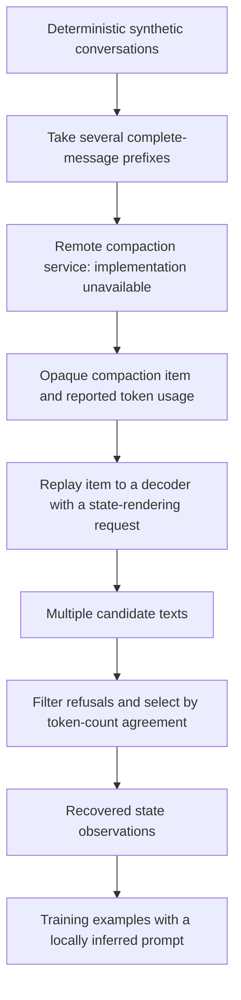

**What `compaction_frontier_v1` actually contains**

Inspection date: 2026-09-11. This is an offline analysis of the supplied code and saved data; no remote compaction or recovery requests were run.

The folder is a black-box compaction research dataset and its collection/recovery pipeline. It does not contain the remote compactor's implementation, weights, internal prompt, or training algorithm. Its useful contribution is a set of observations about compacted conversation state, plus code that converts recovered state into possible training targets.

All 2,061 master rows record `gpt-5.6-luna` as the producer model. The code addresses a ChatGPT-backed Codex compaction endpoint. Those are local provenance claims and requested-model metadata; they cannot establish which weights the server actually used or authenticate the release as provider-authored. The label “frontier” in the directory name establishes neither. The package itself explicitly marks every target as unverified plaintext and not a gold label.

The cited inspiration paper exists: [Panfilov et al., *Stealing Reasoning Traces from Proprietary LLM APIs*](https://arxiv.org/abs/2608.09867), submitted August 10, 2026. Its subject is encrypted reasoning-item replay. This package describes a local adaptation to a different object, `compaction_summary`. The paper citation does not authenticate this dataset or reveal a compaction implementation.

**The code's data flow**



1. **Generate histories.** [content_lib.py](../compaction_frontier_v1/code/content_lib.py) constructs code, math, JSON, logs, dialogue, and search-style messages. Assistant replies are also generated templates, not actual tool executions. Repeated identifiers and changing `SALT-...` sentinels permit exact string-matching checks. [big_scale.py:31](../compaction_frontier_v1/code/big_scale.py) repeats these blocks into long conversations and takes prefixes at approximate token cutoffs. These are independent compactions of original history prefixes; this is not an experiment that repeatedly compacts its previous summary.
2. **Call the unknown compactor.** [capture_raw.py:31](../compaction_frontier_v1/code/capture_raw.py) sends a model name and the input messages to the remote service. The summarization logic is entirely on the other side of this call. The local request supplies no summarizer prompt or explicit summary-length budget. The result contains an opaque item and output-token usage.
3. **Recapture the opaque items.** The first collection retained IDs and envelope lengths but discarded full encrypted content. A second pass captured fresh items for the same prefixes. All original/fresh IDs differ. The retained envelope and the target output-token count come from the same fresh call. Different IDs do not, by themselves, prove that the underlying summaries differ.
4. **Render retained state through the service.** [advanced_recovery.py:71](../compaction_frontier_v1/code/advanced_recovery.py) passes the native item back in a fresh decoder request, followed by an instruction to reproduce retained compacted state. It does not locally decrypt the envelope. The state decoder receives the item and recovery request, rather than the full original transcript. Source facts are used later for scoring.
5. **Select candidates.** The primary run samples ten Luna responses per item. Cases with more than 10% token error can receive Terra fallback and bounded rescue variants. [assemble_advanced_recovery.py:38](../compaction_frontier_v1/code/assemble_advanced_recovery.py) selects the final candidate. Of 104 winners, 85 use Luna, 19 Terra; 102 use `state_exact`, two use `handoff_fixed`.
6. **Build training views.** [build_sft_v2.py:121](../compaction_frontier_v1/code/build_sft_v2.py) appends a locally written checkpoint instruction and the recovered target to the original conversation. It exports training data; it contains no optimizer or model-training loop.

The older recovery route in `recover_big.py` selected among four candidates using known synthetic fact hits, with output length as a tiebreaker. These legacy labels are weaker and affected by oracle-assisted selection. They should not be combined with advanced targets without preserving this distinction.

**What its fidelity score means**

The advanced candidate score is:

```text
recovered_tokens = input tokens billed when re-feeding candidate text - 6
error = abs(1 - recovered_tokens / remote_compact_output_tokens)
```

The six-token correction comes from the package's reported single-user-message calibration. Refusals are filtered with a regular expression, and the candidate with the lowest error wins. Identifier support can break ties in the analysis stage. This is a measure of length agreement with the unknown compacted output, not retention of the original conversation's information.

I independently recomputed the following from saved Parquet rows:

| Recovery stage | Items or attempts | Within 5% token error |
|---|---:|---:|
| Primary Luna, replicate 0 only | 104 items | 41/104 |
| All primary Luna candidates | 1,040 attempts | 412/1,040 |
| Best valid primary Luna candidate per item | 104 items | 84/104 |
| Final selection including fallback/rescue | 104 items | 101/104 |
| Final selection on the designated holdout | 92 items | 89/92 |

The final median error is 0.521%. The final performance depends heavily on repeated sampling and selection; it is not a single-request recovery success rate. “Replicate 0” is the saved replicate index, not necessarily the first response to finish in the concurrent run.

An additional finding: **84 of 104 selected texts are exactly four tokens shorter than the reported compact output after the six-token echo correction.** Eight more are five tokens shorter. This concentration is consistent with a systematic representation or accounting difference, potentially framing around the compacted text. The files do not establish its cause. It strengthens the case that there is regular structure behind the measurement, while making literal interpretations of the residual percentage questionable. I did not change the correction or rerank examples to improve the score.

The saved no-envelope control reports approximately 98.9% median error. That and source-specific identifiers support the interpretation that recovered outputs depend on the supplied item. However, even exact token equality cannot identify a string uniquely. Recovery prompts and decoder behavior may also transform the state. This inspection did not reproduce the remote controls. The claimed 100,000-permutation result is inserted as a constant in the release-building code; I did not find a permutation-test implementation in the supplied code, so I treat it as a reported result.

**What the recovered states suggest about compaction**

The outputs often preserve an interaction pattern, selected exact recent messages, the apparent current task, and guidance for the next response. They sometimes retain code/config excerpts verbatim and sometimes add cautions about earlier unsupported claims. This looks like a continuation checkpoint shaped by expected future behavior. The observation applies to the recovered renderings; the contribution of the remote compactor versus the recovery decoder cannot be completely separated.

Three exported examples make the behavior concrete. Each export includes the last four source messages and the full recovered target:

| Example | Original input tokens | Remote compact tokens | Recovered tokens | Known unique sentinels retained |
|---|---:|---:|---:|---:|
| [Short history](compaction-frontier-inspection/example-1.md) | 1,127 | 1,070 | 1,066 | 100% |
| [Approximately 100k](compaction-frontier-inspection/example-2.md) | 99,667 | 138 | 134 | 0.335% |
| [Largest input](compaction-frontier-inspection/example-3.md) | 398,958 | 329 | 325 | 0.0848% |

The short example retains code and config details and explicitly recognizes that the last user message was already acknowledged. The largest example reduces 4,692 messages to the repetitive interaction pattern, the latest config, and an expected acknowledgment. The roughly 100k example similarly focuses on the latest dialogue fact and flag. These are illustrative cases selected by input size, not averages.

There is a concrete **turn-boundary inconsistency** in the two longer exports: each source history already ends with the assistant acknowledging the latest user message, but the recovered state says the assistant needs to answer it. A faithful continuation should distinguish “already answered; awaiting user” from “response pending.” The files do not tell us whether the compactor or the recovery step introduced this inconsistency.

Compression is also highly dependent on the content. Across all master examples, the median compact output is about 663 tokens below 5k input, 697 tokens in the 25k–100k band, and 690 tokens in the 300k–400k band. The last band has only eight examples. These repetitive synthetic histories let a model describe a general pattern in little space; this does not establish a fixed production summary budget or comparable performance on real engineering tasks.

The advanced targets' median unique-sentinel recall drops from 43.1% below 5k input to 0.600% in the 300k–400k band, while median identifier support in the latter band is 99.1%. Both can be true: almost all identifiers that survive are grounded in the source, while almost all source identifiers are omitted. Sentinel recall does not measure whether omitted facts were useful for the task, and it cannot prove that those facts are absent from the opaque item itself.

**What we can use for our own research**

The useful design hypothesis is to allocate context according to what is needed to continue. An approximation inspired by these observations could identify the interaction pattern, preserve relevant recent evidence exactly, summarize repetition, track unresolved obligations, and record the current turn boundary. This is a proposed implementation, not recovered provider pseudocode:

```text
checkpoint(history, budget):
    identify the last user event and whether it has already been answered
    track unresolved requests, constraints, and commitments
    retain exact supporting identifiers and necessary recent excerpts
    collapse repeated or superseded material
    distinguish completed actions from proposed next actions
    fit the checkpoint within the declared token budget
```

This connects directly to our [context-compiler research plan](CONTEXT_COMPILER_STARTER_PLAN.md). A small checkpoint can preserve the information needed for the next acknowledgment while losing a fact needed much later. The source stream's repeated acknowledgments largely reward immediate continuity; it does not establish delayed-dependency preservation or terminal task success.

A focused next experiment would reveal a random identifier early, insert many apparently completed interactions, compact, and then require that exact identifier for a later action. Compare a plain continuation checkpoint with one that explicitly records unresolved obligations and their evidence, using the same model and token budget. Evaluate the final action, stale-fact use, and duplicate execution. Include histories ending on both user and assistant turns, and repeat compaction across multiple cycles. Those interventions address gaps exposed here without depending on opaque-item recovery.

The eight-line prompt in [build_sft_v2.py:28](../compaction_frontier_v1/code/build_sft_v2.py) is a reasonable candidate baseline instruction, explicitly written by the dataset author. Its desired behavior exceeds what every recovered target demonstrates. Treat it as a hypothesis to evaluate, not a recovered internal prompt or a guarantee about the labels.

The advanced training file contains 86 examples, with loss intended only on the final assistant target. Weights reduce domination by parents with multiple prefixes and downweight larger token errors. The optional mixed training file has 311 rows, including lower-weight legacy targets. The preference file contains 86 pairs across all splits—72 train, nine validation, five test—and ranks length fidelity rather than human judgments of semantic quality. No trained compactor or training-result evaluation is bundled.

**Verification and practical limits**

All 71 manifest-listed file hashes and sizes match. All 16 Parquet files decode. The bundled checks for identities, envelope hashes, candidate joins, confidence arithmetic, selected statistics, and trainer split isolation pass after two in-memory portability adaptations: POSIX path normalization on Windows and skipping checks against unavailable original source paths. An independent recomputation of advanced unique-fact hit counts also matches every row.

The release references 40 original files under the author's `raw/`, `dataset/`, and `notes/` layout, none of which exists at those original paths in this package. Some contents are copied elsewhere or materialized into the Parquet tables; this is not evidence that all underlying data are missing. It does mean the original validator and build scripts do not run unchanged as a fully self-contained rebuild. I preserved the supplied release and saved adaptations in a separate [offline inspection script](../scripts/inspect-compaction-frontier.py).

The 104 advanced examples represent 70 parent windows. The designated 92-example prompt holdout represents 65 parents and shares six parent windows with the 12 discovery examples. Thus it is a holdout of exact prefixes/envelopes, not fully unseen parent conversations. The separate trainer train/validation/test isolation checks do pass. The package calls the prompt holdout “pre-registered,” but that designation alone does not independently establish when its protocol was fixed. Row-level confidence intervals also do not account for dependence among prefixes from the same parent.

The complete recomputed numbers are in [audit.json](compaction-frontier-inspection/audit.json). A further systematic sample of recovered heads/tails is in [qualitative-samples.json](compaction-frontier-inspection/qualitative-samples.json). An interactive visual explorer of the compactor and recovery pipeline is available in [compaction_algorithm_visualizer.html](compaction_algorithm_visualizer.html). These artifacts support using the release to formulate and inspect compaction hypotheses; they do not certify provider provenance, exact plaintext recovery, or downstream task performance.
